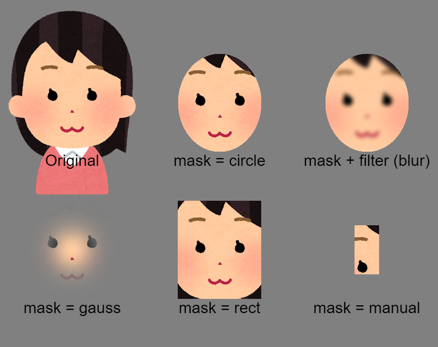

You can apply masking/filtering to image files.

Masking is useful for cropping a specific area of an image. You can select a masking type among 'circle', 'rect', 'gauss', and 'manual'. Filtering is useful for, for example, blurring an image. Filtering is not a feature of the psychophysics plugin, but rather an experimental feature provided by canvas. For more information, please check [this page](https://developer.mozilla.org/en-US/docs/Web/API/CanvasRenderingContext2D/filter).

See the image section of [Stimulus parameters](https://jspsychophysics.hes.kyushu-u.ac.jp/objectProperties.html) to learn how to apply masking/filtering the image.

See also [the demos/mask_filter.html](https://www.hes.kyushu-u.ac.jp/~kurokid/jspsychophysics/demos/mask_filter.html).