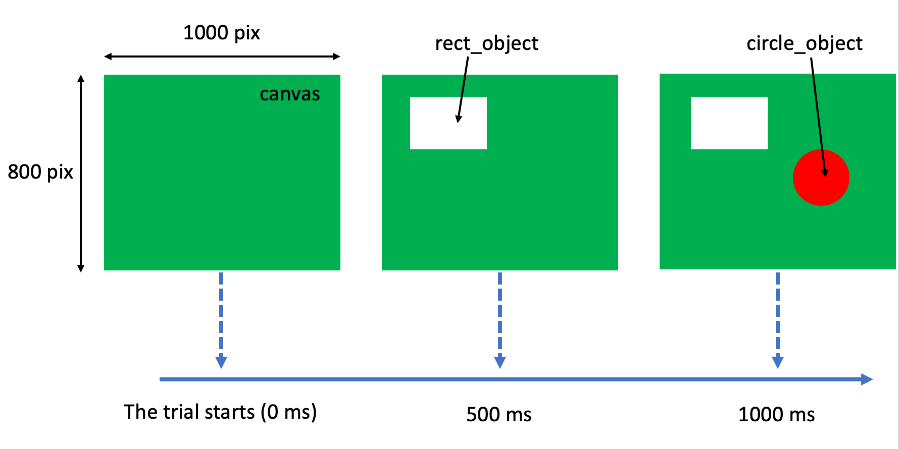

The jspsych-psychophysics plugin is developed for conducting online/Web-based psychophysical experiments using [jsPsych](http://www.jspsych.org/) (de Leeuw, 2015). [This plugin has been published in Behavior Research Methods](https://link.springer.com/article/10.3758/s13428-020-01445-w). You can use this plugin free of charge under the MIT license.

## What you can do with the jspsych-psychophysics plugin
- You can present multiple stimuli asynchronously. In other words, you can set stimulus onset asynchronies (SOAs) in a single trial.
- You can present visual stimuli (e.g., [gabor patches](/gabor/), images, lines, rectangles, circles, and texts) at intended coordinates, and the time duration can be specified in terms of both milliseconds and frames. You can also move these stimuli, and play sound files although the time accuracy is not so good.
- This plugin presents visual stimuli synchronized with the refresh of the display using the **requestAnimationFrame** method. According to my observation, the SOA between visual stimuli with the plugin was more accurate than that without the plugin ([Kuroki, 2020](https://rdcu.be/b5Nie)).
- [Starting with version 3.2, this plugin can present visual stimuli using PixiJS functionality.](/pixijs/)
- You can specify the mouse/keyboard event handler. For example, you can make a program in which a participant change the luminance of a stimulus pressing the ArrowUp/ArrowDown key, and finish the trial pressing the space key. See [the FAQ 7](/faq/) and [this issue](https://github.com/kurokida/jspsych-psychophysics/issues/27).
- Participants' responses can be captured using the keyboard, mouse or buttons. The position of the mouse click can be recorded as a response.
- [You can apply masking/filtering to image files](/mask_filter/).

## How to use the jspsych-psychophysics plugin
This is a brief explanation how to use the plugin. Please refer to [Plugin parameters](/pluginParams/) and [Stimulus parameters](/objectProperties/) in detail.

This figure illustrates a trial flow to be made by this tutorial.


You can see [the sample of this tutorial.](https://www.hes.kyushu-u.ac.jp/~kurokid/jspsychophysics/demos/tutorial.html)

### 1. Download the plugin package.
[Please download the latest plugin files from GitHub.](https://github.com/kurokida/jspsych-psychophysics/releases)
The package includes the comaptible [jsPsych](http://www.jspsych.org/) (de Leeuw, 2015). The psychophysics plugin is released under [the MIT license](https://opensource.org/licenses/MIT).


### 2. Include the plugin file using the `<script>` tag

```javascript
<script src="jspsych-psychophysics.js"></script>
```
This procedure is the same as other plugins are used with the jsPsych. Note the location of the plugin file.

### 3. Specify all stimuli used in the program as JavaScript objects

```javascript
const rect_object = {
    obj_type: 'rect', // means a rectangle
    startX: 200, // location in the canvas
    startY: 150,
    width: 300, // of the rectangle
    height: 200,
    line_color: '#ffffff',
    fill_color: '#ffffff',
    show_start_time: 500 // from the trial start (ms)
}

const circle_object = {
    obj_type: 'circle',
    startX: 500, // location in the canvas
    startY: 300,
    radius: 100,
    line_color: 'red', // You can use the HTML color name instead of the HEX color.
    fill_color: 'red',
    show_start_time: 1000 // from the trial start (ms)
}
```

The default origin of the coordinate is the top left of the canvas, but the origin can be changed to the center of the window (canvas) by specifying the `origin_center` property as true. The unit is the pixel. 

The color can be specified using the HTML color names, hexadecimal (HEX) colors, and RGB values that are often used in a general HTML file.

The **show_start_time** property is one of the most notable properties, which enables to present the stimulus at the intended time. In this example, a white rectangle is presented 500 ms after beginning this trial, after another 500 ms, a red circle is presented until the response.

### 4. Specify a trial object including all the stimuli in the jsPsych's timeline

```javascript

const jsPsych = initJsPsych()

const trial = {
    type: jsPsychPsychophysics,
    stimuli: [rect_object, circle_object],
    choices: ['y', 'n'], // The participant can respond to the stimuli using the 'y' or 'n' key.
    canvas_width: 1000,
    canvas_height: 800,
    background_color: '#008000', // The HEX color means green.
}

jsPsych.run([trial])

```

Note that since jsPsych V7, you need to specify type: jsPsychPsychophysics.

The **stimuli** array must include all the stimulus objects to be presented in the trial.

This trial object must be passed as an argument to the `jsPsych.run` function.

If you use image and audio files in a trial, please preload them at the begging of the program using [the preload plugin](https://www.jspsych.org/7.1/plugins/preload/). See, [demos/randomizedImages.html](https://www.hes.kyushu-u.ac.jp/~kurokid/jspsychophysics/demos/randomizedImages.html) and [demos/twoSoundsWithSOA.html](https://www.hes.kyushu-u.ac.jp/~kurokid/jspsychophysics/demos/twoSoundsWithSOA.html). 

The other applications and the tabs in a web browser should be closed during the experiment. This should be informed as an instruction at the begging of the experiment.

## Demonstrations
[The jspsych-psychophysics package includes a lot of demonstration files.](/demo_explanation/)

## FAQ
Before asking a question, please read [the FAQ page](/faq/). When your question remains, please post it on [the issuues of the GitHub](https://github.com/kurokida/jspsych-psychophysics/issues).

## Open Science Framework
The data and materials of my paper are available at [Open Science Framework](https://doi.org/10.17605/OSF.IO/PJ4SB).

## Citation
I would appreciate it if you could cite [Kuroki (2020)](https://rdcu.be/b5Nie) as well as [de Leeuw (2015)](https://link.springer.com/article/10.3758/s13428-014-0458-y) when you report your research using this plugin.

- de Leeuw, J.R. jsPsych: A JavaScript library for creating behavioral experiments in a Web browser. Behav Res 47, 1–12 (2015). https://doi.org/10.3758/s13428-014-0458-y
- Kuroki, D. A new jsPsych plugin for psychophysics, providing accurate display duration and stimulus onset asynchrony. Behav Res 53, 301–310 (2021). https://doi.org/10.3758/s13428-020-01445-w

***

Copyright (c) 2019 Daiichiro Kuroki  
Released under [the MIT license](https://opensource.org/licenses/MIT)
